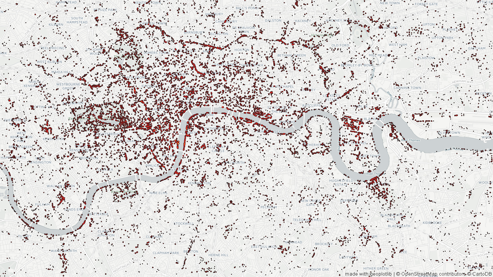

# pokemining
Jupyter notebook of PokemonGO spawn data

The API was shut down, so the data here is considered final, I'll add some more interesting analysis over time. 

Note: Nests seem to have changed. [Checkout the reddit post to map probable new nest locations to the images.](https://www.reddit.com/r/TheSilphRoad/comments/4v78mw/psa_nests_have_changed/)